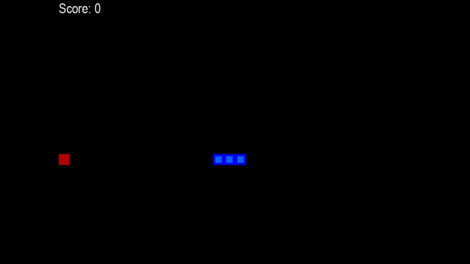

# SnaQe - A Q-Learning Network playing the mobile classic
This repository is about training a reinforcement learning agent to play the mobile game Snake using a Q-Net. The result after training looks like this:

## Table of Contents

- [Installation](#installation)
- [Usage](#usage)
- [License](#license)

## Installation
To run the project, simply install the <code>requirements.txt</code> and run the <code>Run_agent.ipynb</code> notebook.

## Usage
To train the agent, simply follow the <code>Run_agent.ipynb</code> notebook. If you want to skip the training, you can also look at the training progress or watch the live videos in the same notebook.

## License
This project is published under the MIT License. For details, please see the [LICENSE](./LICENSE) file.